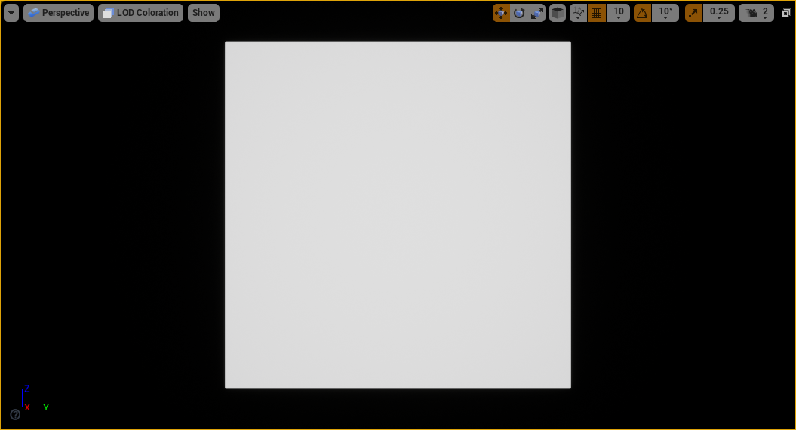
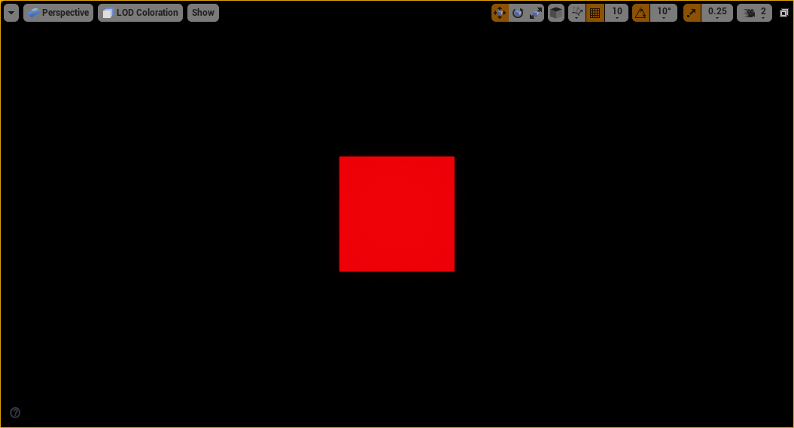
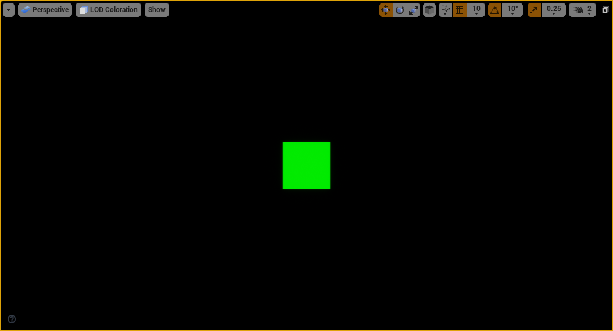

# UE4 LOD Screen Size

## Data
```cpp
class FStaticMeshRenderData
{
    FPerPlatformFloat ScreenSize
};

ComputeBoundsScreenSize(Origin, SphereRadius, View.ViewMatrices.GetViewOrigin(), View.ViewMatrices.GetProjectionMatrix());


FStaticMeshSceneProxy::FLODInfo::FLODInfo
class FStaticMeshRenderData
{
    FPerPlatformFloat ScreenSize
};


```

## Compute
```cpp
FLODMask FStaticMeshSceneProxy::GetLODMask(const FSceneView* View) constLODMask FStaticMeshSceneProxy::GetLODMask(const FSceneView* View) const;

Result.SetLOD(ComputeStaticMeshLOD(RenderData, ProxyBounds.Origin, ProxyBounds.SphereRadius, *View, ClampedMinLOD, InvScreenSizeScale));Result.SetLOD(ComputeStaticMeshLOD(RenderData, ProxyBounds.Origin, ProxyBounds.SphereRadius, *View, ClampedMinLOD, InvScreenSizeScale));


int8 ComputeStaticMeshLOD( const FStaticMeshRenderData* RenderData, const FVector4& Origin, const float SphereRadius, const FSceneView& View, int32 MinLOD, float FactorScale )
{
	if (RenderData)
	{
		const int32 NumLODs = MAX_STATIC_MESH_LODS;
		const FSceneView& LODView = GetLODView(View);
		const float ScreenRadiusSquared = ComputeBoundsScreenRadiusSquared(Origin, SphereRadius, LODView) * FactorScale * FactorScale * LODView.LODDistanceFactor * LODView.LODDistanceFactor;

		// Walk backwards and return the first matching LOD
		for (int32 LODIndex = NumLODs - 1; LODIndex >= 0; --LODIndex)
		{
			if (FMath::Square(RenderData->ScreenSize[LODIndex].GetValueForFeatureLevel(View.GetFeatureLevel()) * 0.5f) > ScreenRadiusSquared)
			{
				return FMath::Max(LODIndex, MinLOD);
			}
		}
	}

	return MinLOD;
}

float ComputeBoundsScreenRadiusSquared(const FVector4& BoundsOrigin, const float SphereRadius, const FVector4& ViewOrigin, const FMatrix& ProjMatrix)
{
	// ignore perspective foreshortening for orthographic projections
	const float DistSqr = FVector::DistSquared(BoundsOrigin, ViewOrigin) * ProjMatrix.M[2][3]; // 1.0, DistSqr = 360000

	// Get projection multiple accounting for view scaling.
	const float ScreenMultiple = FMath::Max(0.5f * ProjMatrix.M[0][0], 0.5f * ProjMatrix.M[1][1]); // 1.206

	// Calculate screen-space projected radius
    // 10907.63 / 360000 ~= 0.0303
	return FMath::Square(ScreenMultiple * SphereRadius) / FMath::Max(1.0f, DistSqr);
}


```


```
SphereRadius = 86.6025391

Origin = {X=0.000000000 Y=0.000000000 Z=0.0000000 }

ViewOrigin = {X=-600.000000 Y=0.000000000 Z=0.000000000 }

View.ViewMatrices.GetProjectionMatrix().M

[0] = 0x000002152d42a8d0 {1.30322540, 0.000000000, 0.000000000, 0.000000000}
[1] = 0x000002152d42a8e0 {0.000000000, 2.41211009, 0.000000000, 0.000000000}
[2] = 0x000002152d42a8f0 {0.000000000, 0.000000000, 0.000000000, 1.00000000}
[3] = 0x000002152d42a900 {0.000000000, 0.000000000, 10.0000000, 0.000000000}
```

## FViewMatrices
```cpp
	/** ViewToClip : UE4 projection matrix projects such that clip space Z=1 is the near plane, and Z=0 is the infinite far plane. */
	FMatrix		ProjectionMatrix;
	/** ViewToClipNoAA : UE4 projection matrix projects such that clip space Z=1 is the near plane, and Z=0 is the infinite far plane. Don't apply any AA jitter */
	FMatrix		ProjectionNoAAMatrix;
	/** ClipToView : UE4 projection matrix projects such that clip space Z=1 is the near plane, and Z=0 is the infinite far plane. */
	FMatrix		InvProjectionMatrix;
	// WorldToView..
	FMatrix		ViewMatrix;
	// ViewToWorld..
	FMatrix		InvViewMatrix;
	// WorldToClip : UE4 projection matrix projects such that clip space Z=1 is the near plane, and Z=0 is the infinite far plane. */
	FMatrix		ViewProjectionMatrix;
	// ClipToWorld : UE4 projection matrix projects such that clip space Z=1 is the near plane, and Z=0 is the infinite far plane. */
	FMatrix		InvViewProjectionMatrix;
	// HMD WorldToView with roll removed
	FMatrix		HMDViewMatrixNoRoll;
	/** WorldToView with PreViewTranslation. */
	FMatrix		TranslatedViewMatrix;
	/** ViewToWorld with PreViewTranslation. */
	FMatrix		InvTranslatedViewMatrix;
	/** WorldToView with PreViewTranslation. */
	FMatrix		OverriddenTranslatedViewMatrix;
	/** ViewToWorld with PreViewTranslation. */
	FMatrix		OverriddenInvTranslatedViewMatrix;
	/** The view-projection transform, starting from world-space points translated by -ViewOrigin. */
	FMatrix		TranslatedViewProjectionMatrix;
	/** The inverse view-projection transform, ending with world-space points translated by -ViewOrigin. */
	FMatrix		InvTranslatedViewProjectionMatrix;
	/** The translation to apply to the world before TranslatedViewProjectionMatrix. Usually it is -ViewOrigin but with rereflections this can differ */
	FVector		PreViewTranslation;
	/** To support ortho and other modes this is redundant, in world space */
	FVector		ViewOrigin;
	/** Scale applied by the projection matrix in X and Y. */
	FVector2D	ProjectionScale;
	/** TemporalAA jitter offset currently stored in the projection matrix */
	FVector2D	TemporalAAProjectionJitter;

	/**
	 * Scale factor to use when computing the size of a sphere in pixels.
	 * 
	 * A common calculation is to determine the size of a sphere in pixels when projected on the screen:
	 *		ScreenRadius = max(0.5 * ViewSizeX * ProjMatrix[0][0], 0.5 * ViewSizeY * ProjMatrix[1][1]) * SphereRadius / ProjectedSpherePosition.W
	 * Instead you can now simply use:
	 *		ScreenRadius = ScreenScale * SphereRadius / ProjectedSpherePosition.W
	 */
	float ScreenScale;

	//
	// World = TranslatedWorld - PreViewTranslation
	// TranslatedWorld = World + PreViewTranslation
	// 

	// ----------------
```


* The ScreenSize being set in the StaticMesh editor is actually the clip-space bounding sphere diameter
  * For example, 1.0 means a clip-space bounding sphere with radius = 0.5

* ComputeBoundsScreenRadiusSquared() will returns the squared clip-space radius (depend on the camera distance, FOV, aspect ratio)

### Examples

* SRS  = Screen-Radius-Squared

* Test static mesh: 1m x 1m x1m cube with screen size set to:
  * LOD0 = 1.0
  * LOD1 = 0.5
  * LOD2 = 0.25

* FOV = 75,  Camera distance = 2m; SRS = 0.272731602; (2 * sqrt(SRS) = 1.04)



* FOV = 75,  Camera distance = 5m; SRS = 0.0436370596;  (2 * sqrt(SRS) = 0.41)



* FOV = 75,  Camera distance = 9m; SRS = 0.0134682283; (2 * sqrt(SRS) = 0.23)



